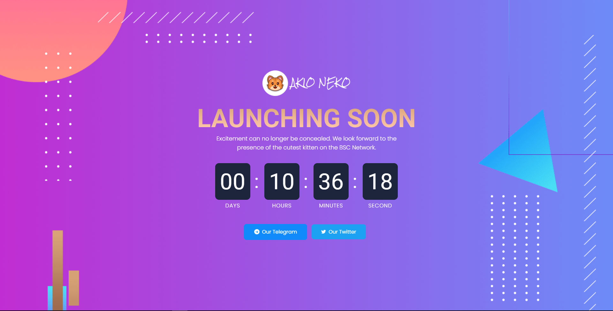
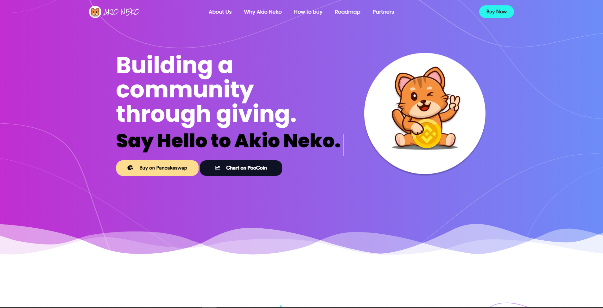
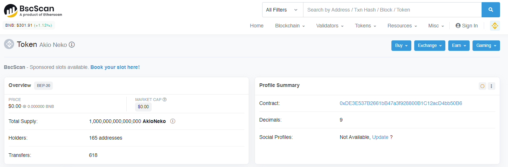

# Akio Neko

Akio Neko  is the first project from Azmir Shah and Mohd Firas. This project is our first smart contract developed on the Binance Smart Chain Platform. Inspired by Doge’s success, our mission is to deliver the best community project and charity for the community of cat lovers.

The source code is divided into three sections:
* The pre-launch landing page.
* The post-launch landing page.
* The smart contract itself.

The website are built with HTML, CSS, and Javascript, while smart contracts are made with Solidity. 

# 1. Pre-launch Landing Page

The Pre-launch website went live on Thursday (July 15, 2021) at 14:00UTC, one day before the official launch date. At this point, I've set up a count-down timer on the website to remind visitors of our launch date the following day. The contract will be made public after the timer expires on Friday (July 16, 2021) at 14:00 UTC.

The source code for this page is accessible on the **[Feature/count-down](https://github.com/azmirshah1/akioNeko/tree/feature/count-down)** branch.

# 2. Post-launch Landing Page

This is the Akio Neko token's official website. Akio Neko's main mascot was an orange kitten. This website provides important token information such as tokenomics, holders, locked LP, Pancakeswap link, chart, roadmap, and so on.

The source code for this page is accessible on the **[Release](https://github.com/azmirshah1/akioNeko/tree/release)** branch.

# 3. Akio Neko Smart contract

Contract information for Akio Neko can be accessed in the following repositories: **[Akio-Neko Contract](https://github.com/azmirshah1/AkioNeko-contract)** 

---

You can visit our website at [akioneko.com](https://akioneko.com/).

